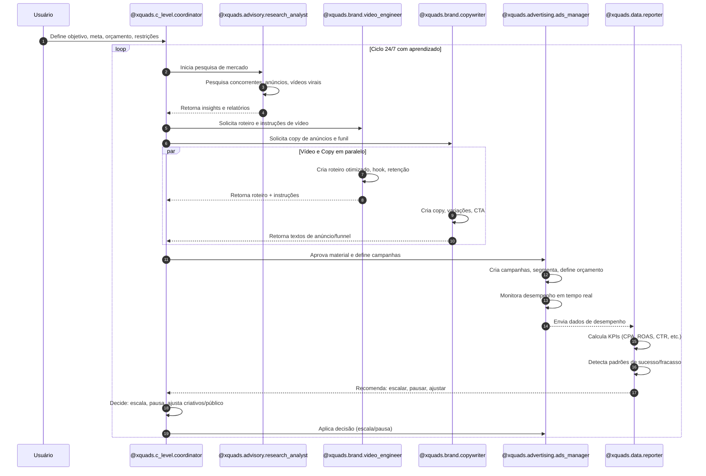
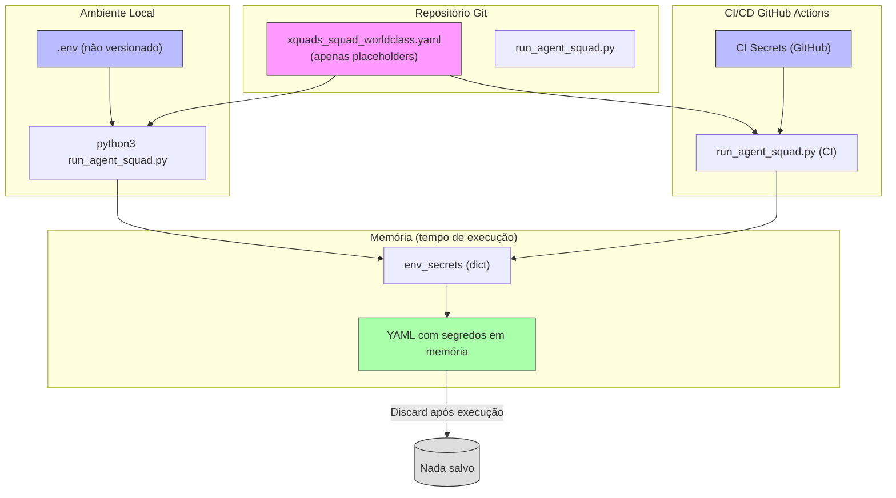
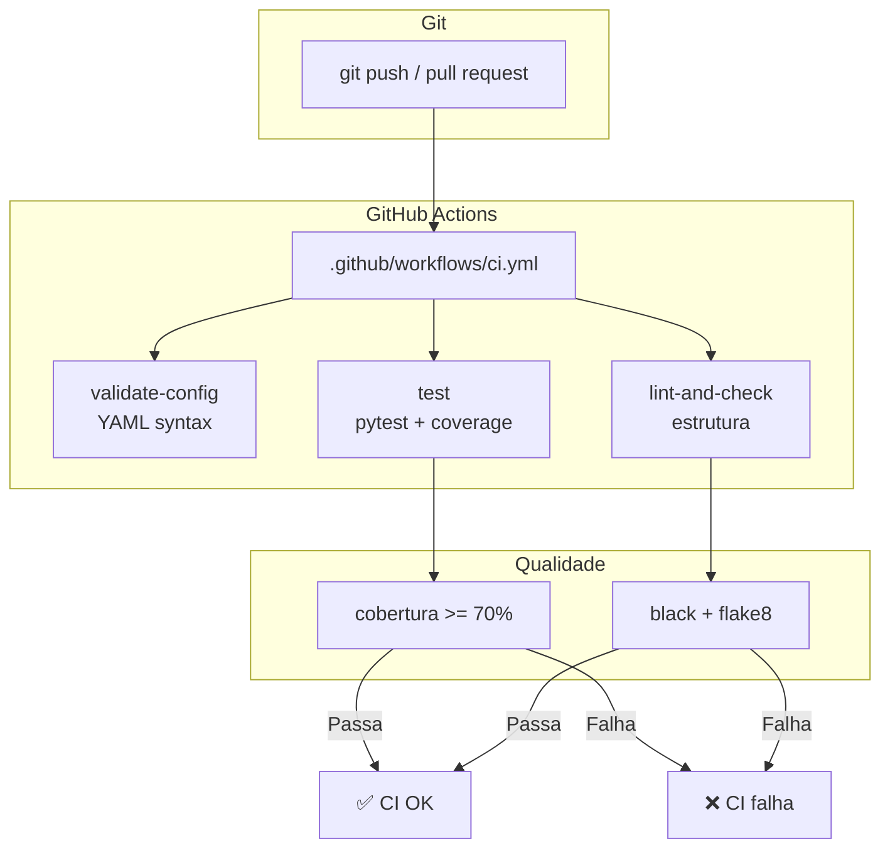

## 📄 `ARCHITECTURE.md` (atualizado com diagrama de fluxo completo)
# ARCHITECTURE.md

## Arquitetura do XQuads Squad Worldclass  
**Agência de IA 24/7 baseada em 6 agentes, com foco em performance digital, segurança de segredos e automação.**

---

## 1. Visão geral da arquitetura

O sistema é composto por:

1. **Núcleo de configuração**  
   - `xquads_squad_worldclass.yaml` / `.json`  
   - Contém:  
     - 6 agentes (Coordinator, Research, Video, Copy, Ads, Data).  
     - Prompts, fluxos, regras.  
     - Placeholders de segredos (`%%VARIAVEL%%`).  

2. **Script de execução**  
   - `run_agent_squad.py`  
   - Funções:  
     - **Validar automaticamente variáveis de ambiente**.  
     - Ler YAML.  
     - Carregar `.env` (ou variáveis de ambiente do CI/CD).  
     - Substituir placeholders em memória.  
     - Iniciar o orquestrador de agentes (Claude Code / API).  

3. **Segredos e segurança**  
   - `.env` local (não versionado).  
   - Secrets do CI/CD (GitHub Actions, etc.).  
   - Nenhum segredo no YAML, no código ou nos logs.  

4. **CI/CD e qualidade**  
   - `.github/workflows/ci.yml`  
   - Jobs:  
     - `validate-config`: valida sintaxe do YAML.  
     - `test`: roda testes com pytest + cobertura.  
     - `lint-and-check`: verifica estrutura, .gitignore, pastas.  

5. **Documentação e prompts**  
   - `docs/`: documentação oficial (agentes, fluxo, regras, segurança).  
   - `prompts/`: system prompts individuais de cada agente.  

6. **Logs e monitoramento**  
   - `logs/deploy.log`  
   - Registros de execução sem expor segredos.

---

## 2. Diagrama de arquitetura (flowchart)

```mermaid
flowchart TD
    subgraph User ["Usuário"]
        U[("Usuário / Operador")]
    end

    subgraph Config ["Configuração (YAML/JSON)"]
        YAML["xquads_squad_worldclass.yaml"]
        JSON["xquads_squad_worldclass.json"]
    end

    subgraph Secrets ["Segredos (não versionado)"]
        ENV[".env (local)"]
        CI_SECRETS["CI/CD Secrets (GitHub Actions)"]
    end

    subgraph Script ["Script Principal"]
        RUN["run_agent_squad.py"]
        VALIDATE["validate_environment()<br/>Validação automática"]
        LOAD_ENV["load_env_vars()"]
        REPLACE["replace_secrets_in_text()"]
        ORCHESTRATOR["call_agent_orchestrator()"]
    end

    subgraph Agents ["Squad de 6 Agentes"]
        COORD["@xquads.c_level.coordinator<br/>Diretor Geral / Estratégia"]
        RESEARCH["@xquads.advisory.research_analyst<br/>Pesquisa e Mercado"]
        VIDEO["@xquads.brand.video_engineer<br/>Especialista de Vídeo"]
        COPY["@xquads.brand.copywriter<br/>Criação e Texto"]
        ADS["@xquads.advertising.ads_manager<br/>Gestor de Tráfego"]
        DATA["@xquads.data.reporter<br/>Análise de Dados"]
    end

    subgraph Docs ["Documentação"]
        DOCS_FILES["docs/*"]
        PROMPTS["prompts/*"]
    end

    subgraph Logs ["Logs e Monitoramento"]
        LOG["logs/deploy.log"]
    end

    subgraph CI ["CI/CD GitHub Actions"]
        CI_WF[".github/workflows/ci.yml"]
        VALIDATE["validate-config<br/>YAML syntax"]
        TEST["test<br/>pytest + coverage"]
        LINT["lint-and-check<br/>estrutura"]
    end

    # Fluxo principal
    U -->|Define objetivo, meta, orçamento| COORD
    COORD -->|Inicia ciclo| RESEARCH
    RESEARCH -->|Insights| COORD
    COORD -->|Orquestra em paralelo| VIDEO
    COORD -->|Orquestra em paralelo| COPY
    VIDEO -->|Roteiro, instruções| COORD
    COPY -->|Copy, variações| COORD
    COORD -->|Aprova material| ADS
    ADS -->|Campanhas, dados| DATA
    DATA -->|Relatório de KPIs| COORD
    COORD -->|Decide: escala, pausa, ajusta| ADS

    # Configuração e segredos
    YAML --> RUN
    JSON -.->|Compatibilidade| RUN
    ENV -->|Carrega .env| LOAD_ENV
    CI_SECRETS -->|Carrega secrets| LOAD_ENV
    LOAD_ENV -->|env_secrets| REPLACE
    RUN -->|YAML com segredos em memória| ORCHESTRATOR
    ORCHESTRATOR -->|Inicia| COORD

    # Logs
    RUN -->|Grava sem expor segredos| LOG

    # Docs e prompts
    DOCS_FILES -.->|Suporte| RUN
    PROMPTS -.->|System prompts| COORD
    PROMPTS -.->|System prompts| RESEARCH
    PROMPTS -.->|System prompts| VIDEO
    PROMPTS -.->|System prompts| COPY
    PROMPTS -.->|System prompts| ADS
    PROMPTS -.->|System prompts| DATA

    # CI/CD
    CI_WF --> VALIDATE
    CI_WF --> TEST
    CI_WF --> LINT
    YAML --> VALIDATE
    YAML -->|Código| TEST
    YAML -->|Código| LINT
```

---

## 3. Fluxo de ciclo de operação (sequence diagram)



---

## 4. Fluxo completo: Validação → YAML → Segredos → Agentes

**Diagrama detalhado do caminho completo**, desde a validação até os agentes.

```mermaid
flowchart TD
    subgraph Start ["1. Início"]
        START[("python3 run_agent_squad.py")]
    end

    subgraph Validation ["2. Validação Automática"]
        VALIDATE["validate_environment()<br/>Verifica variáveis de ambiente"]
        ENV_CHECK{".env existe?"}
        VAR_CHECK{""ALL_VARS" presentes?"}
        ENV_MISSING[".env faltando<br/>ERRO + instruções"]
        VAR_MISSING["Variáveis faltando<br/>ERRO + instruções"]
    end

    subgraph Secrets ["3. Carregamento de Segredos"]
        LOAD_ENV["load_env_vars()<br/>Carrega .env"]
        LOAD_SYSTEM["os.getenv()<br/>Carrega CI/CD secrets"]
        SECRETS_DICT["env_secrets = {<br/>  META_ADS_ACCESS_TOKEN=...,<br/>  GOOGLE_ADS_DEVELOPER_TOKEN=...,<br/>  DATABASE_PASSWORD=...,<br/>  ...<br/>}"]
    end

    subgraph YAML_Processing ["4. Processamento do YAML"]
        READ_YAML["read_yaml_text()<br/>Lê YAML como texto"]
        YAML_FILE["xquads_squad_worldclass.yaml<br/>(apenas placeholders)<br/>%%META_ADS_ACCESS_TOKEN%%<br/>%%GOOGLE_ADS_DEVELOPER_TOKEN%%<br/>%%DATABASE_PASSWORD%%<br/>..."]
        REPLACE["replace_secrets_in_text()<br/>Substitui placeholders em memória"]
        YAML_WITH_SECRETS["YAML com segredos reais<br/>(apenas em memória)<br/>NUNCA salvo em arquivo"]
    end

    subgraph Orchestrator ["5. Orquestrador de Agentes"]
        ORCHESTRATOR["call_agent_orchestrator()<br/>Inicia orquestrador"]
        PARSE_YAML["yaml.safe_load()<br/>Converte para dict"]
        CONFIG_DICT["config = {<br/>  squad: {...},<br/>  agents: [...],<br/>  ...<br/>}"]
    end

    subgraph Agents ["6. Squad de 6 Agentes"]
        COORD["@xquads.c_level.coordinator<br/>Diretor Geral / Estratégia"]
        RESEARCH["@xquads.advisory.research_analyst<br/>Pesquisa e Mercado"]
        VIDEO["@xquads.brand.video_engineer<br/>Especialista de Vídeo"]
        COPY["@xquads.brand.copywriter<br/>Criação e Texto"]
        ADS["@xquads.advertising.ads_manager<br/>Gestor de Tráfego"]
        DATA["@xquads.data.reporter<br/>Análise de Dados"]
    end

    subgraph Logs ["7. Logs e Monitoramento"]
        LOG["logs/deploy.log<br/>Nunca expõe segredos"]
    end

    # Fluxo principal
    START --> VALIDATE
    VALIDATE --> ENV_CHECK
    
    ENV_CHECK -->|Não| ENV_MISSING
    ENV_CHECK -->|Sim| VAR_CHECK
    
    VAR_CHECK -->|Não| VAR_MISSING
    VAR_CHECK -->|Sim| LOAD_ENV
    
    LOAD_ENV --> LOAD_SYSTEM
    LOAD_SYSTEM --> SECRETS_DICT
    
    SECRETS_DICT --> READ_YAML
    READ_YAML --> YAML_FILE
    YAML_FILE --> REPLACE
    REPLACE --> YAML_WITH_SECRETS
    
    YAML_WITH_SECRETS --> ORCHESTRATOR
    ORCHESTRATOR --> PARSE_YAML
    PARSE_YAML --> CONFIG_DICT
    
    CONFIG_DICT --> COORD
    COORD --> RESEARCH
    COORD --> VIDEO
    COORD --> COPY
    COORD --> ADS
    ADS --> DATA
    
    # Logs (em todas as etapas)
    START -.->|Log| LOG
    VALIDATE -.->|Log| LOG
    LOAD_ENV -.->|Log| LOG
    REPLACE -.->|Log| LOG
    ORCHESTRATOR -.->|Log| LOG
    COORD -.->|Log| LOG

    # Estilos
    style START fill:#4CAF50,stroke:#333,color:#fff
    style VALIDATE fill:#2196F3,stroke:#333,color:#fff
    style LOAD_ENV fill:#2196F3,stroke:#333,color:#fff
    style READ_YAML fill:#FF9800,stroke:#333,color:#fff
    style REPLACE fill:#FF9800,stroke:#333,color:#fff
    style ORCHESTRATOR fill:#9C27B0,stroke:#333,color:#fff
    style COORD fill:#E91E63,stroke:#333,color:#fff
    style LOG fill:#607D8B,stroke:#333,color:#fff
    style ENV_MISSING fill:#f44336,stroke:#333,color:#fff
    style VAR_MISSING fill:#f44336,stroke:#333,color:#fff
```

---

## 5. Explicação do Fluxo Completo

### 5.1. Início (`python3 run_agent_squad.py`)

- Usuário executa o script.  
- Script inicia e configura logs.

### 5.2. Validação Automática (`validate_environment()`)

- Verifica se `.env` existe.  
- Verifica se **todas as variáveis obrigatórias** estão presentes.  
- Se faltar algo:
  - **Impede inicialização**.  
  - Mostra **mensagem clara** do que falta.  
  - Mostra **instruções de como corrigir**.  
- Se tudo estiver OK:
  - Permite prosseguir.

### 5.3. Carregamento de Segredos

- Carrega `.env` (local).  
- Carrega variáveis do ambiente do sistema (CI/CD secrets).  
- Cria `env_secrets` dict com todas as chaves reais.

### 5.4. Processamento do YAML

- Lê `xquads_squad_worldclass.yaml` como **texto**.  
- YAML contém **apenas placeholders** (`%%VARIAVEL%%`).  
- Substitui **todos os placeholders** por valores reais **em memória**.  
- **NUNCA salva YAML com segredos em arquivo**.

### 5.5. Orquestrador de Agentes

- Converte YAML (com segredos) para `dict`.  
- Inicia orquestrador de agentes.  
- Passa configuração para o Coordenador.

### 5.6. Squad de 6 Agentes

- Coordenador orquestra os outros 5 agentes.  
- Pesquisa, Vídeo, Copy, Ads, Data operam em ciclo 24/7.

### 5.7. Logs e Monitoramento

- Logs em `logs/deploy.log`.  
- **Nunca expõe segredos**.  
- Mostra apenas:
  - "Variável META_ADS_ACCESS_TOKEN carregada."  
  - "Substituindo placeholder de META_ADS_ACCESS_TOKEN no YAML."  
  - **NUNCA**: "Token real: xxx..."

---

## 6. Fluxo de Segurança de Segredos



---

## 7. Componentes principais

| Componente | Função |
|------------|--------|
| `xquads_squad_worldclass.yaml` | Configuração oficial do squad (agentes, prompts, fluxos, regras). |
| `run_agent_squad.py` | Script principal de execução (**com validação automática**), leitura, substituição de segredos em memória, iniciação do orquestrador. |
| `.env` | Variáveis de ambiente locais (não versionado). |
| `CI Secrets` | Variáveis de ambiente do CI/CD (não expostas no repositório). |
| `docs/` | Documentação oficial do projeto. |
| `prompts/` | System prompts individuais de cada agente. |
| `logs/deploy.log` | Logs de execução sem segredos expostos. |
| `.github/workflows/ci.yml` | CI/CD com validação de YAML, testes, cobertura. |
| `Makefile` | Comandos práticos: `make setup`, `make test`, `make coverage`, `make lint`, `make format`. |

---

## 8. Fluxo de CI/CD



---

## 9. Resumo operacional

- **O usuário** → define metas e restrições para o Coordenador.  
- **O Coordenador** → orquestra Pesquisa, Vídeo, Copy, Ads, Data.  
- **O Script** → **valida automaticamente variáveis**, lê YAML, carrega segredos do `.env`/CI, substitui em memória, inicia o squad.  
- **O CI/CD** → valida YAML, roda testes, garante cobertura e estilo.  
- **Segredos** → nunca gravados em arquivos, nunca expostos em logs.

---

Este documento é a referência oficial da arquitetura do **XQuads Squad Worldclass**, com **diagramas visuais completos** mostrando todo o fluxo: **validação → YAML → segredos → agentes**.
